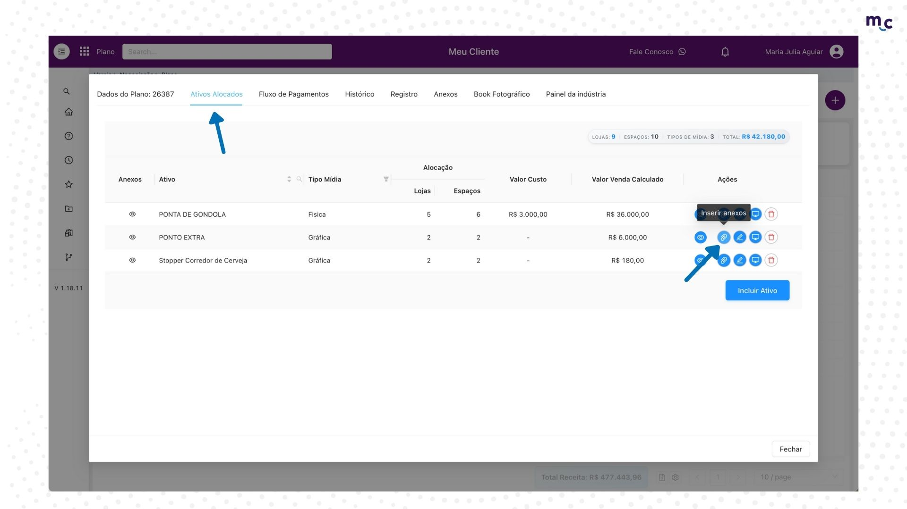
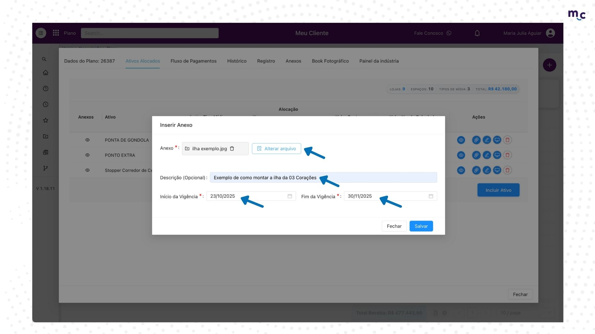
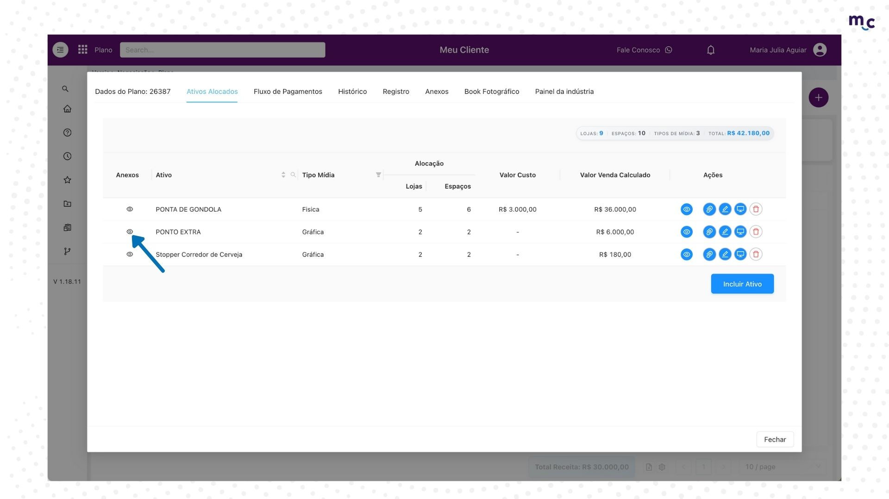
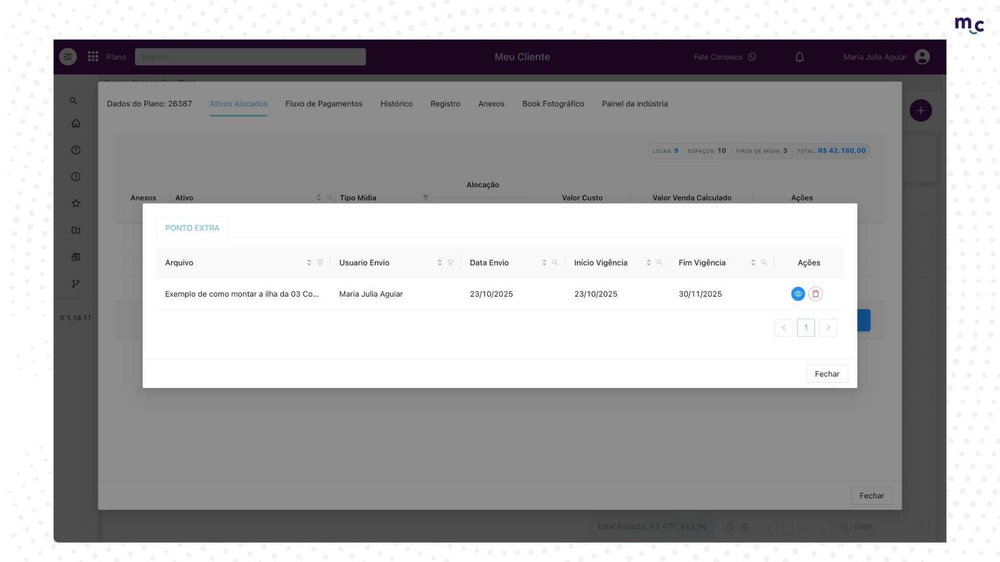
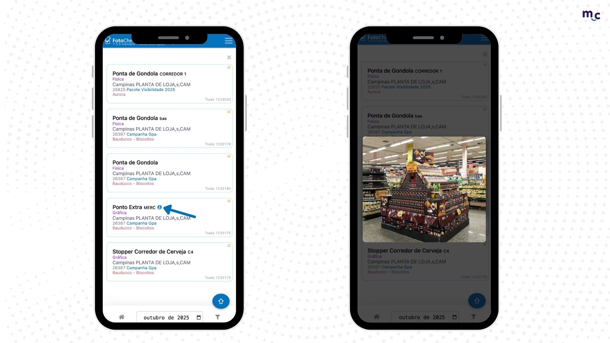

# Anexo nos ativos alocados

Essa novidade foi criada para anexar documentos relacionados a um ativo específico. Usamos como exemplo os casos em que um ponto precisa ser montado exatamente como solicitado pela indústria — assim, é possível adicionar a foto de referência, e o responsável seguirá exatamente o modelo que está no Fotocheck ✅

1. Já dentro do seu plano na aba de **"Ativos Alocados"**, clique no ícone de clips para **"Inserir anexos"**

<figure><figcaption></figcaption></figure>

2. Clique em **"Anexar Arquivo"**\
   Preencha a **"Descrição"** se necessário\
   **Início e fim de vigência** que esse anexo irá aparecer no Fotocheck\
   E por último, **"Salvar"**

<figure><figcaption></figcaption></figure>

3. Clicando no olho do lado do seu ativo você terá o resumo desse anexo

<figure><figcaption></figcaption></figure>

4. Aqui você terá o histórico de quando foi cadastrado esse anexo e os detalhes que foi preenchido

<figure><figcaption></figcaption></figure>

5. Para o seu gerente, irá aparecer um ícone azul do lado do ativo e quando ele clicar, irá aparecer a foto que foi anexada anteriormente.

<figure><figcaption></figcaption></figure>

#### Assim, a comunicação entre varejo e gerentes fica muito mais fácil e rápida, otimizando o seu tempo! ⏰
