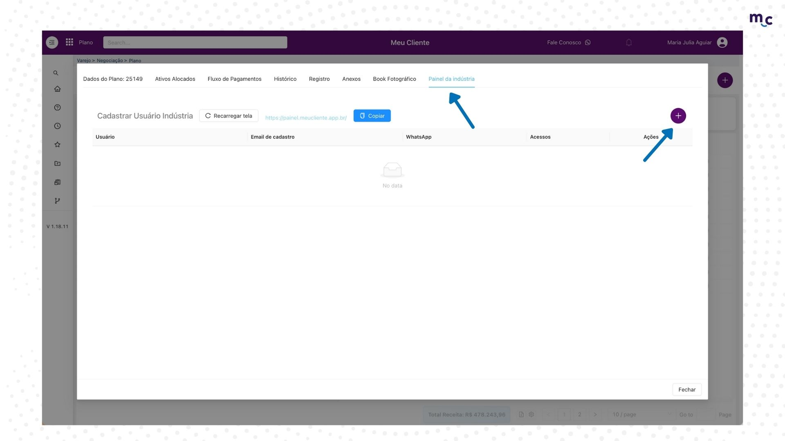
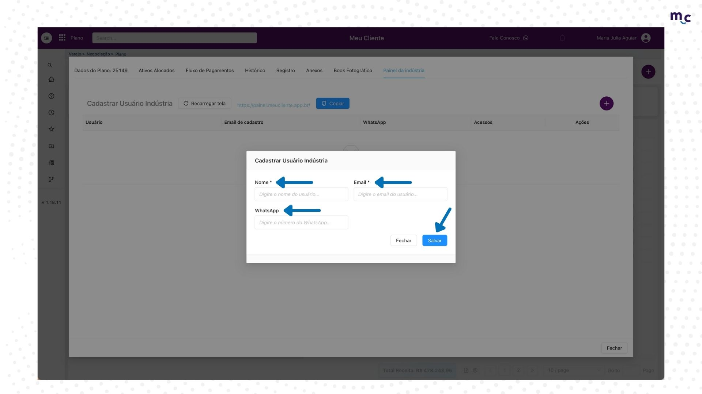
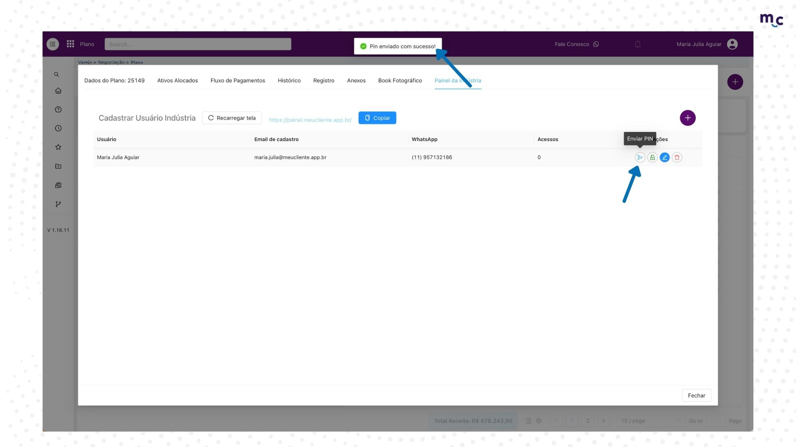

# Envio do PIN indústria

1. Dentro do seu plano, abra a aba de "Painel da Indústria" e clique no + para cadastrar os dados do fornecedor.

<figure><figcaption></figcaption></figure>

2. Cadastre o nome, e-mail e número do WhatsApp com DDD do fornecedor e clique em "salvar"

<figure><figcaption></figcaption></figure>

3. Após o cadastro, clique em Enviar PIN.

<figure><figcaption></figcaption></figure>

4. O PIN chegará no e-mail e no WhatsApp cadastrado.

<figure><figcaption></figcaption></figure>

#### Tornando o envio de senhas rápido e seguro para todos 👨‍💻
