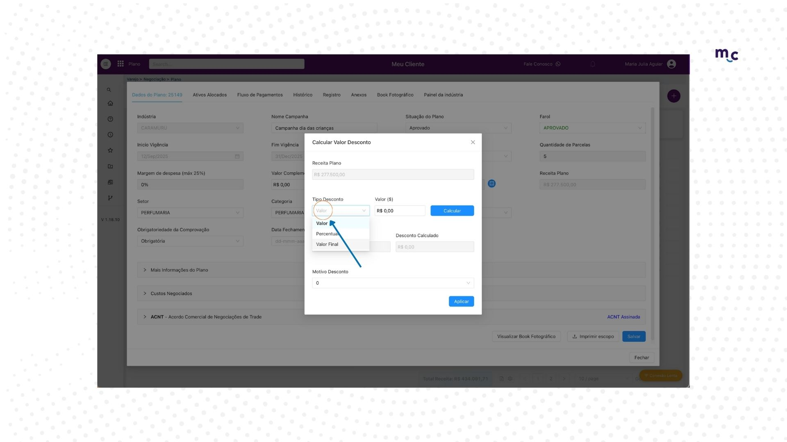
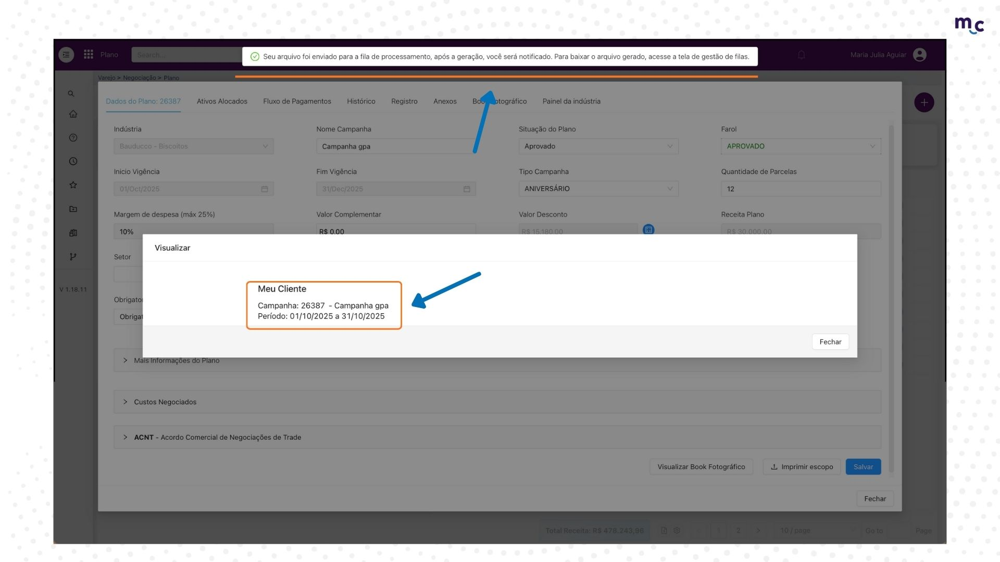
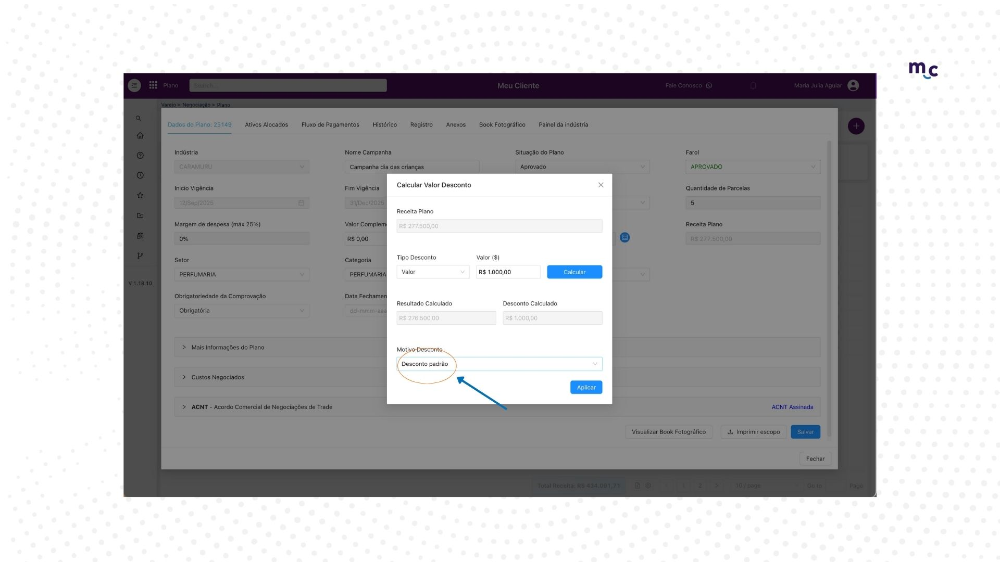
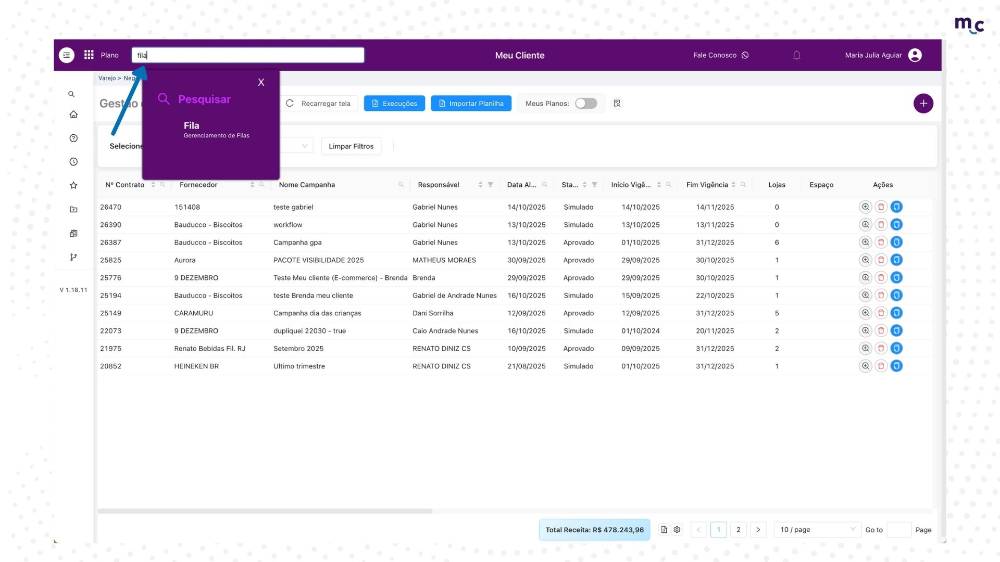

# Fila de PDF do Book Fotográfico

Essa funcionalidade foi criada para reunir em **um único arquivo** todas as comprovações executadas e comprovadas de um plano, organizadas por loja e data. Ao selecionar a data de início e fim, o sistema gera automaticamente o PDF, facilitando a análise geral das ações. ✅

1. Já com o seu plano aberto, na aba de "Dados do plano", clique em **visualizar book fotográfico** ↓

<figure><figcaption></figcaption></figure>

2. Selecione a data de **início** e **fim** das comprovações que deseja incluir e clique em ‘**Gerar**’ ↓

<figure><figcaption></figcaption></figure>

3. Quando aparecer a mensagem "**Seu arquivo foi enviado**", isso significa que ele já está na fila para o download ↓

<figure><figcaption></figcaption></figure>

4. Quando o PDF for gerado, ele irá encaminhar uma mensagem para o seu **e-mail**, avisando que você já pode entrar no sistema e verificar o PDF ↓

<figure><figcaption></figcaption></figure>

5. Entrando na plataforma, você irá pesquisar por "**fila**" ↓

<figure><figcaption></figcaption></figure>

6. Nessa aba você terá o histórico de todos os PDFs solicitados.\
   **Seta Azul =** Apenas visualizar o PDF;\
   **Seta Laranja** **=** Para fazer o download do arquivo.

<figure><figcaption></figcaption></figure>

#### Todos os PDFs ficarão em uma só tela, facilitando a sua organização! 🗂️
