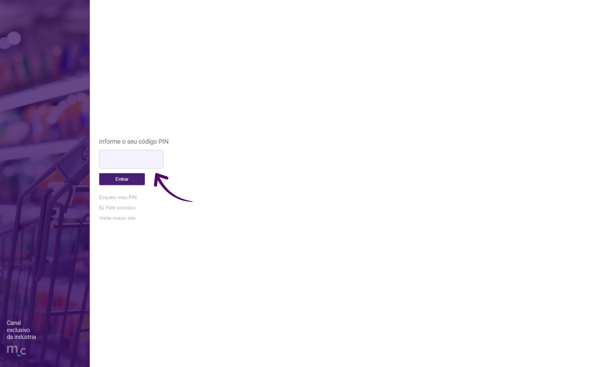
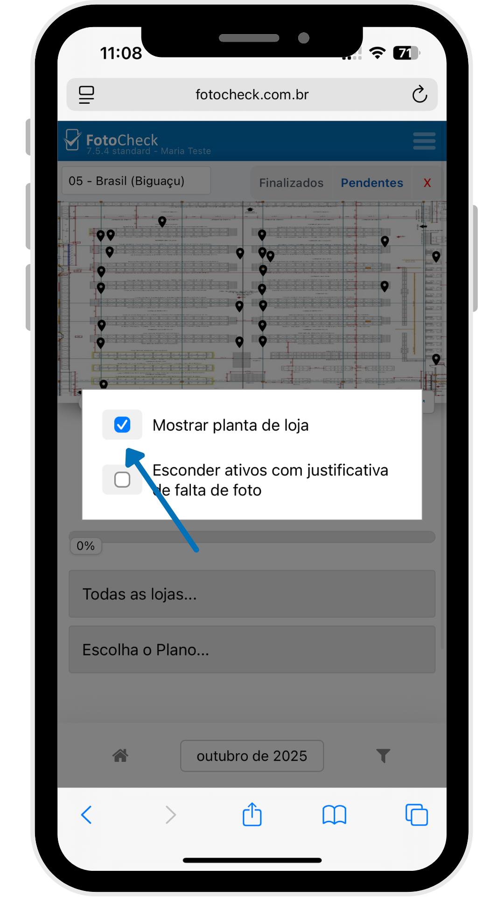
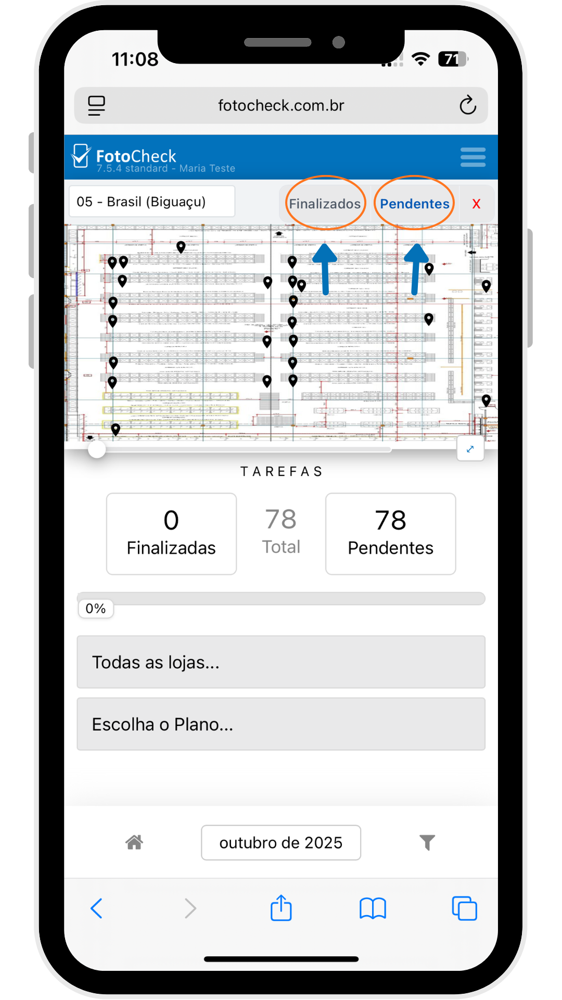
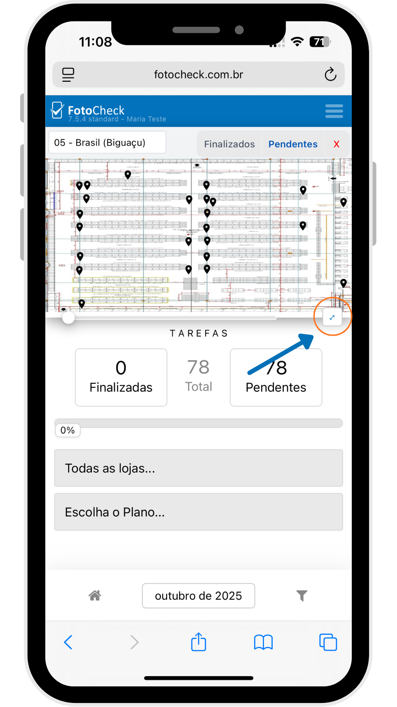
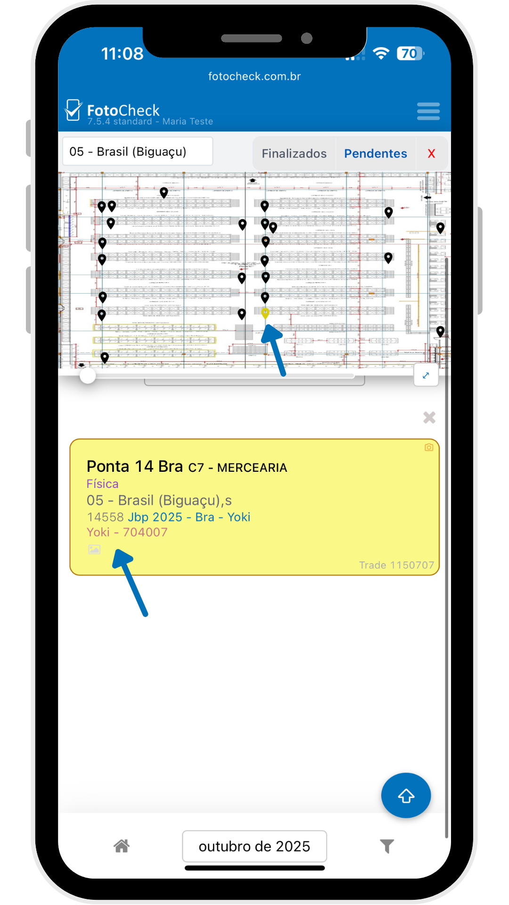

# Planta de loja - Fotocheck

↓ Já com o Fotocheck aberto, clique no filtro do lado direito inferior&#x20;

<figure><figcaption></figcaption></figure>

↓ Selecione a opção "Mostrar planta de loja"&#x20;

<figure><figcaption></figcaption></figure>

↓ Você terá 2 opções:\
"**Pendentes**" que irá mostrar todas as comprovações que ainda **não** foram comprovadas;\
"**Finalizadas**" que terá todos os pontos que **já** foram comprovados.

<figure><figcaption></figcaption></figure>

↓ No ícone de expansão podemos aumentar a planta de loja para melhor usabilidade

<figure><figcaption></figcaption></figure>

↓ Com o mapa aberto, basta clicar no **ponto** desejado para realizar a comprovação ou clicar no **X** para voltar ao menu principal&#x20;

<figure><figcaption></figcaption></figure>

↓ Depois de clicar no ponto desejado, basta fazer a comprovação normalmente clicando na aba amarela sinalizada logo abaixo

<figure><figcaption></figcaption></figure>

### 📸 Agora é possível visualizar a **planta de loja** direto pelo **Fotocheck**, deixando suas comprovações ainda mais completas e organizada!&#x20;
