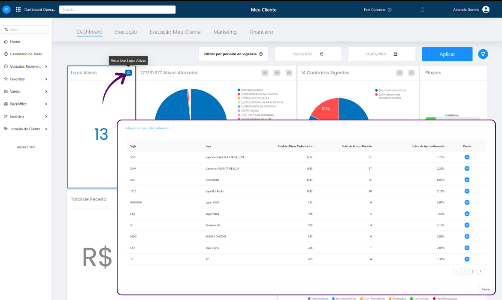

---
---

# Dashboard

## Sejam Bem Vindos ao Treinamento do Dashboard 📊

Neste treinamento, você aprenderá como visualizar e filtrar todas as informações relacionadas ao seu varejo e às campanhas de trade marketing vinculadas a ele.

Os dados apresentados são fictícios e servem apenas como exemplo para fins de treinamento.



***

### 1. Para iniciar, acesse a plataforma Meu Cliente com o seu usuário e senha.

👉 [https://login.meucliente.app.br/dashboard](https://login.meucliente.app.br/dashboard)

↓ A tela de _Dashboard_ é sempre a primeira que será exibida ao realizar o login na plataforma.&#x20;

<figure><figcaption>
Os dados apresentados são fictícios e servem apenas como exemplo para fins de treinamento.
</figcaption></figure>

***

### 2. Logo no topo, é possível aplicar filtros por período de vigência.

↓ Abaixo desse filtro, são exibidos indicadores importantes como:

* Lojas Ativas
* Ativos Alocados&#x20;
* Contratos Vigentes
* Status dos Players (Online/Offline)
* Total de Receita
* Tarefas

<figure><figcaption>
Os dados apresentados são fictícios e servem apenas como exemplo para fins de treinamento.
</figcaption></figure>

↓ Sempre que você clicar no ícone de olho, serão exibidas informações mais detalhadas sobre aquele indicador ou gráfico.

<figure><figcaption>
Os dados apresentados são fictícios e servem apenas como exemplo para fins de treinamento.
</figcaption></figure>

***

### 3. Descendo a página, é possível visualizar gráficos de desempenho detalhados que mostram a evolução da receita ao longo dos meses.

Essas informações ajudam a comparar o desempenho entre anos e analisar o crescimento por diferentes perspectivas, como:

* Evolução Perfomance Receita (comparativo entre 2024 e 2025)
* Receita por bandeira
* Receita por tipo de fornecedor
* Receita por parceiro

↓ Os filtros disponíveis no topo de cada gráfico permitem uma análise mais segmentada conforme o interesse do usuário.

<figure><figcaption>
Os dados apresentados são fictícios e servem apenas como exemplo para fins de treinamento.
</figcaption></figure>

***

### 4. É possível visualizar também indicadores gráficos que comparam o desempenho e os investimentos realizado, facilitando a tomada de decisão estratégica.

Dentre eles:

* Investimento por Parceiro: mostra quais parceiros investiram mais no período analisado.
* Desempenho por Loja: apresenta as lojas com maior retorno gerado.
* Desempenho de Ativos: permite acompanhar quais tipos de ativos geraram mais resultado.

↓ Esses gráficos possuem filtros que permitem organizar os dados por maior investimento ou maior retorno, oferecendo uma visão personalizada e comparativa do desempenho das campanhas.

<figure><figcaption>
Os dados apresentados são fictícios e servem apenas como exemplo para fins de treinamento.
</figcaption></figure>

***

## Agora você já conhece todas as principais funcionalidade do _Dashboard_ e sabe como acompanhar, filtrar e analisar os dados de desempenho do seu varejo. 📈

