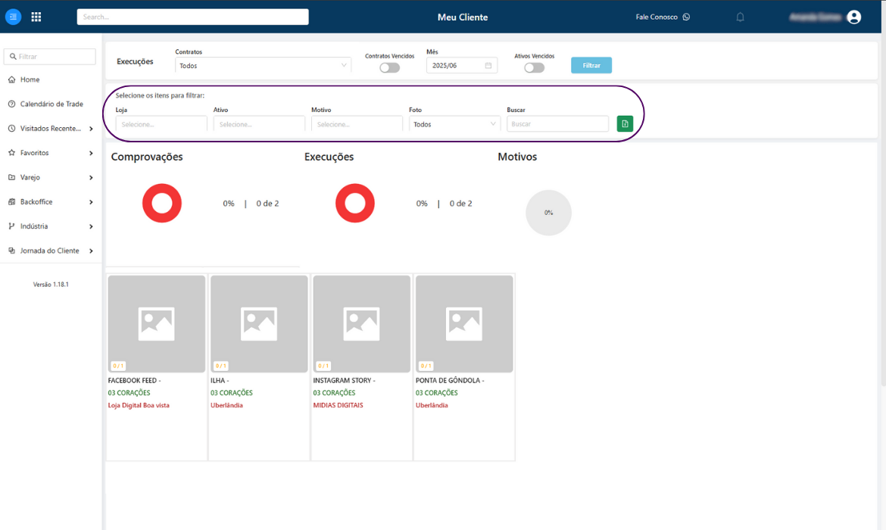
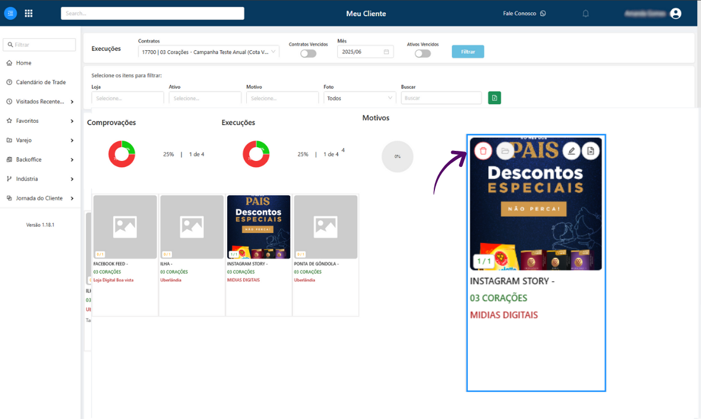

---
---

# Visão Execução

## Sejam bem-vindos ao treinamento da Visão Execução 🔎

Neste treinamento, vocês irão aprender como utilizar a plataforma para verificar todas os ativos que precisam ser executados e comprovados.



***

### 1. Para iniciar, acessa a plataforma Meu Cliente e entre com o seu usuário e senha.

👉 [https://login.meucliente.app.br/dashboard](https://login.meucliente.app.br/dashboard)

Ao entrar você estará na página principal, chamada Dashboard.

↓ Clique na barra de pesquisa, digite "Execuções" e selecione a opção para acessar a tela de Visão Execução.

<figure><figcaption></figcaption></figure>

***

### 2. Ao acessar a tela "Visão Execução", você encontrará alguns filtros disponíveis para facilitar a visualização das informações.

* **Contratos**: onde você pode selecionar o contrato específico que deseja visualizar na tela.
* **Contratos Vencidos**: botão de ativação que, quando ligado, exibe apenas os contratos cujo prazo já expirou.
* **Mês**: campo onde você define o mês de referência para consulta das execuções.
* **Ativos Vencidos**: botão de ativação que, ao ser habilitado, filtra e exibe somente os ativos que estão vencidos.
* **Filtrar**: botão utilizado para aplicar os filtros selecionados e exibir os resultados de acordo com os critérios definidos.

↓ Após definir os critérios desejados, basta clicar no botão azul **“Filtrar”** para aplicar os filtros e visualizar os dados conforme selecionado.

<figure><figcaption></figcaption></figure>

***

### 3. A segunda coluna de filtros é mais flexível, sendo possível filtrar informações com base em critérios mais específicos.

* **Loja**: permite selecionar uma loja específica para visualizar apenas as execuções relacionadas a ela.
* **Ativo**: possibilita o filtro por um ativo determinado, facilitando a busca por execuções de itens específicos.
* **Motivo**: filtra os registros com base no motivo da execução ou pendência que são enviados pelo Fotocheck.
* **Foto**: permite escolher se deseja visualizar todos os ativos, apenas os que têm foto ou os que estão sem foto.
* **Buscar**: campo livre para digitar termos específicos e localizar informações de forma rápida.

↓ Ao ajustar esses filtros, você consegue refinar ainda mais a visualização dos dados conforme a sua necessidade.

<figure><figcaption></figcaption></figure>

***

### 4. Essa sessão da tela apresenta um resumo visual de desempenho

Dividido em três indicadores principais:

* **Comprovações**: exibe o percentual de comprovações realizadas em relação ao total previsto.&#x20;
* **Execuções**: mostra o andamento das execuções, caso haja o envio de algum motivo de não execução, esse percentual também irá refletir essa informação.
* **Motivos**: representa os registros que foram justificados com algum motivo da não execução.

↓ Esses gráficos são úteis para ter uma visão rápida e clara sobre o andamento das atividades e onde estão os principais pontos de atenção.

<figure><figcaption></figcaption></figure>

***

### 5. Cada quadrado representa um ativo que precisa ser executado e comprovado.

Dentro de cada card, são apresentadas as seguintes informações:

* **Nome do ativo**
* **Indústria/Fornecedor**
* **Local de execução** (que pode ser uma loja física ou ambiente digital)
* Um marcador de status no canto inferior esquerdo do card, como **0/1**, que indica a quantidade de comprovações realizadas sobre o total esperado.

↓ Ao clicar no ícone de folha no canto superior direito do quadrado, é possível enviar uma comprovação para o ativo exibido.

<figure><figcaption></figcaption></figure>

***

### 6. Assim que uma comprovação é enviada corretamente, os gráficos do sistema são atualizados automaticamente&#x20;

Além disso, no canto superior do quadrado, aparecem alguns ícones com funções específicas:

* **Ícone de Lixeira:** Permite excluir a comprovação enviada, caso tenha sido anexada incorretamente ou precise ser substituída.
* **Ícone de Computador/Celular**: Indica a origem da comprovação enviada, ou seja, neste caso, o envio foi feito diretamente pelo computador.
* **Ícone de Lápis:** Ao clicar neste botão, é possível editar a data da execução ou até mesmo substituir o arquivo da comprovação, caso necessário.
* **Ícone de Documento:** Serve para enviar uma nova comprovação adicional para o mesmo ativo, caso seja necessário reforçar ou complementar o envio anterior.

<figure><figcaption></figcaption></figure>

#### ⚠ Essa visão é ideal para o envio de comprovações digitais.

Já para ativos físicos em loja, o mais indicado é realizar o envio via aplicativo _Fotocheck_, que garante maior precisão no registro da execução no ponto de venda, pois a comprovação é capturada e enviada em tempo real, assegurando que o ativo está executado exatamente no momento da captura.

***

### Agora você já sabe como usar o _Visão Execução_ para realizar suas comprovações digitais de forma simples e rápida. 💯

