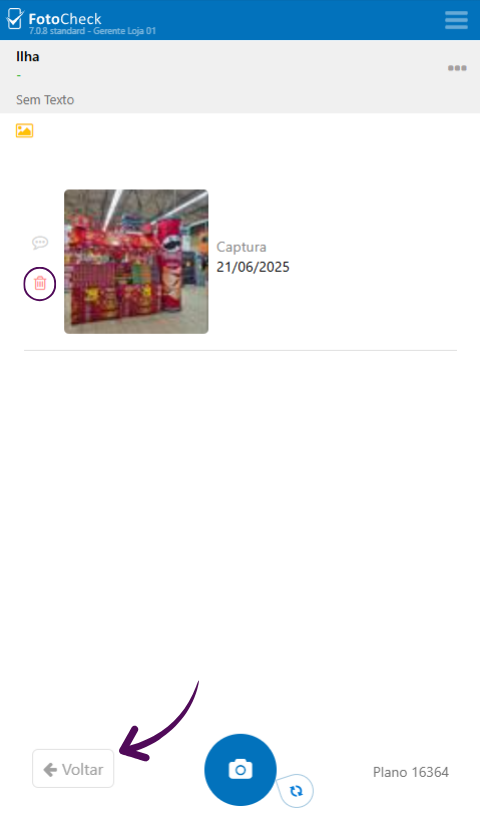
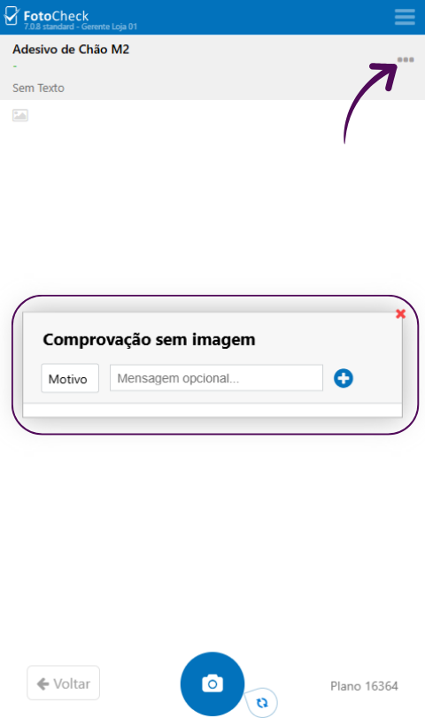

# Fotocheck

## Sejam bem-vindos ao treinamento da ferramenta de comprovações Fotocheck 📸

Neste treinamento, vocês irão aprender como utilizar o Fotocheck para realizar as comprovações dos ativos de chão de loja de forma prática e eficiente.



***

### 1. Para começar, acesse o site do Fotocheck:

👉 [https://www.fotocheck.com.br/](https://www.fotocheck2.com.br/)

Insira seu PIN e depois, clique em "Entrar" para acessar a tela principal.

<figure><figcaption>
Insira seu PIN e depois, clique em "Entrar" para acessar a tela principal.
</figcaption></figure>

***

### 2. Essa é a pagina inicial, nela você verá o total de tarefas, além da quantidade de tarefas pendentes e tarefas finalizadas.

Clique em Pendentes para visualizar todas as tarefas que precisam ser comprovadas no mês.

<figure><figcaption>
Clique em Pendentes para visualizar todas as tarefas que precisam ser comprovadas no mês.
</figcaption></figure>

***

### 3. Cada tarefa exibe informações importantes, como o nome do ativo, a loja, onde o ativo está alocado, o nome da indústria e a quantidade de fotos a serem enviadas.

Para comprovar, basta clicar no ativo que deseja enviar a comprovação.

<figure><figcaption>
Para comprovar, basta clicar no ativo que deseja enviar a comprovação.
</figcaption></figure>

***

### 4. Nesta tela você poderá escolher o tipo de comprovação, sendo possível enviar uma Foto, um Vídeo ou um Áudio.

Ao clicar no ícone que você escolheu, a câmera do seu celular será aberta para você capturar a imagem ou vídeo.

<figure><figcaption>
Ao clicar no ícone que você escolheu, a câmera do seu celular será aberta para você capturar a imagem ou vídeo.
</figcaption></figure>

***

### 5. Posicione a câmera de forma que apareça o ativo por completo.

Depois de tirar a foto, clique em Usar Foto e, em seguida Enviar.

<figure><figcaption>
Depois de tirar a foto, clique em Usar Foto e, em seguida Enviar.
</figcaption></figure>

***

### 6. A comprovação será registrada e aparecerá nesta página. Caso necessário, você poderá apagar essa foto.

Clique em Voltar para concluir a tarefa, que irá para a aba de finalizadas.

<figure><figcaption>
Clique em Voltar para concluir a tarefa, que irá para a aba de finalizadas.
</figcaption></figure>

***

### 7. Caso você não consiga realizar a comprovação, pois não há como executar aquele ativo no momento, é possível informar o motivo.

Entrando na tela do ativo, clique nos três pontinhos no canto superior direito da tela. Escolha o motivo, escreva a justificativa, clique no ícone de +, e seu motivo será enviado.

<figure><figcaption>
Clique nos três pontinhos no canto superior direito da tela. Escolha o motivo, escreva a justificativa, clique no ícone de +, e seu motivo será enviado.
</figcaption></figure>

***

### Agora você já sabe como usar o _Fotocheck_ para realizar suas comprovações de forma simples e rápida. 📱

