---
---

# Gestão de Planos

## Sejam bem-vindos ao treinamento de Gestão de Planos 📄&#x20;

Neste treinamento, você irá aprender como utilizar a plataforma para lançar seus contratos de trade marketing.



***

### 1. Para iniciar, acesse a plataforma Meu Cliente com o seu usuário e senha.

👉 [https://login.meucliente.app.br/dashboard](https://login.meucliente.app.br/dashboard)

Ao entrar você estará na página principal, chamada Dashboard.

↓ Clique na barra de pesquisa, digite "Plano" e selecione a opção para acessar a tela de Gestão de Planos.

<figure><figcaption></figcaption></figure>

***

### 2. Nesta tela, você encontrará filtros que podem ser utilizados e verá todas as informações dos planos que já foram lançados.

↓ Antes de lançar um novo plano, é importante garantir que algumas informações já estejam cadastradas no sistema.

<figure><figcaption></figcaption></figure>

***

### 3.  Para lançar um novo plano, é necessário que a indústria esteja cadastrada no sistema.

↓ Para isso, acesse a tela “Gerenciar Indústria”, clique no botão “+” e preencha todos os campos com as informações necessárias, depois clique em “Salvar”.

<figure><figcaption></figcaption></figure>

***

### 4. Também é necessário que os ativos estejam devidamente cadastrados.

↓ Acesse a tela “Gerenciar Ativos de Trade”, clique no botão “+”, preencha todos os campos com as informações necessárias e, em seguida, clique em “Salvar”.

<figure><figcaption></figcaption></figure>

***

### 5. Ao cadastrar um novo ativo, é necessário vinculá-lo a uma loja.

↓ Para isso, acesse a tela “Gerenciar Inventário”, selecione a loja desejada clicando no ícone da lupa e, em seguida, clique em “Incluir Inventário”.

<figure>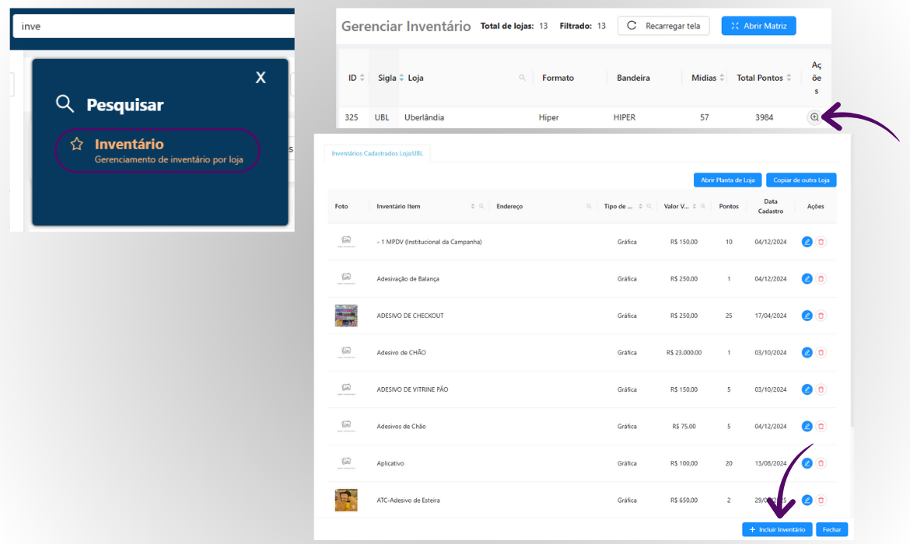<figcaption></figcaption></figure>

↓ Em seguida, digite o nome do ativo que deseja alocar, informe a quantidade, clique na opção “Disponível” e, por fim, clique em “+” e salve as informações.

<figure>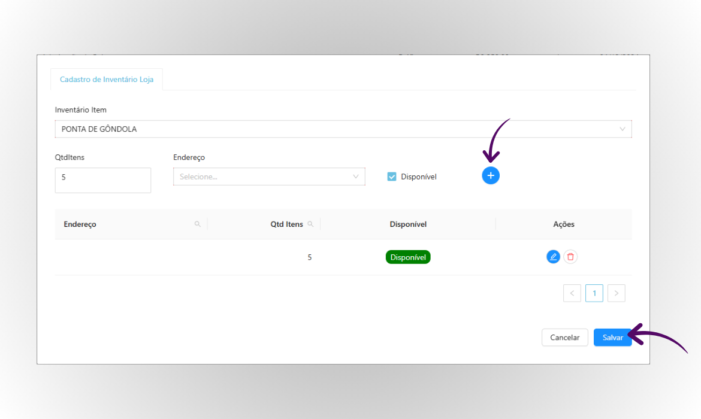<figcaption></figcaption></figure>

***

### 6. Voltando à tela de "Gestão de Planos".

↓ Para lançar um novo plano, clique em “+” canto direito superior da tela.

<figure><figcaption></figcaption></figure>

***

### 7. Adicione todas as informações do plano, como a indústria, o nome da campanha e as datas de início e fim de vigência.

↓ Clique na opção “Filtrar Inventário” e preencha as informações do ativo que deseja adicionar ao seu plano. Em seguida, clique em “Continuar”.

<figure>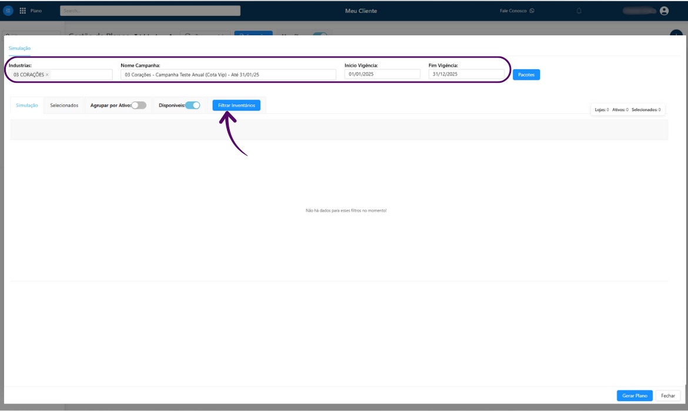<figcaption></figcaption></figure>

↓ Após isso, o ativo será exibido na tela. Clique no ícone de cadeado para alocar o ativo e, por fim, clique em “Gerar Plano”.

<figure>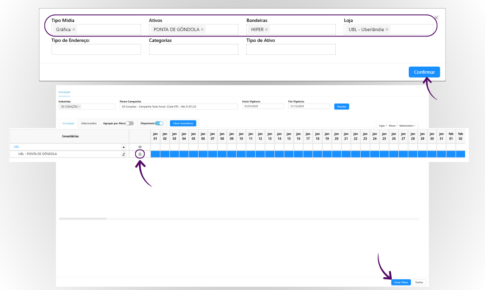<figcaption></figcaption></figure>

***

### 8. Ao gerar um novo plano, serão exibidas várias abas, cada uma com funcionabilidades especificas, para que você possa editar e configurar seu plano conforme necessário.

↓ Na primeira aba, chamada “Dados do Plano”, você encontrará todas as informações essenciais do novo plano.&#x20;

<figure>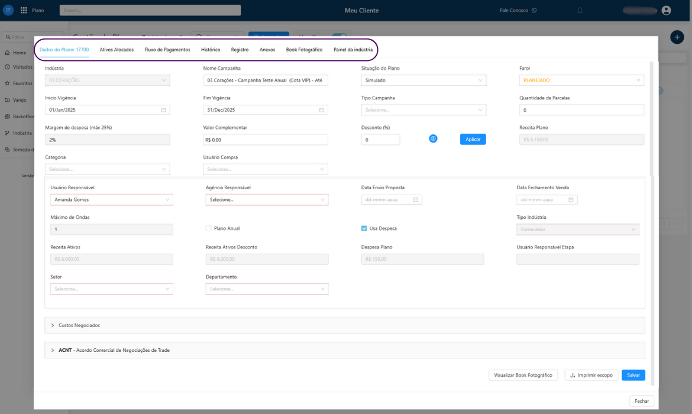<figcaption></figcaption></figure>

***

### 9. Na aba "Ativos Alocados", é possível editar os ativos que já foram adicionados ou incluir novos ativos ao plano.

↓ Ao clicar em “Incluir Ativos”, a seguinte aba será exibida:

<figure>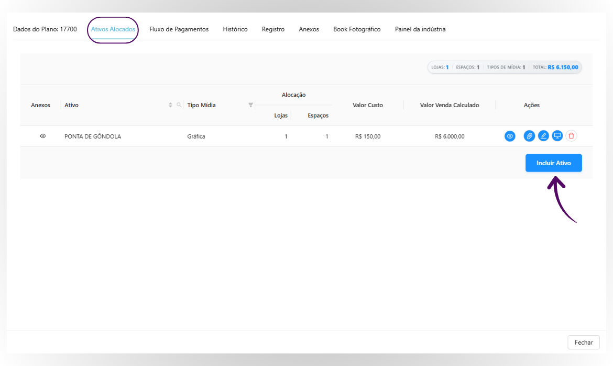<figcaption></figcaption></figure>

↓ Digite o nome do ativo, selecione a loja em que deseja alocar, informe a quantidade e clique em “Salvar”.

<figure>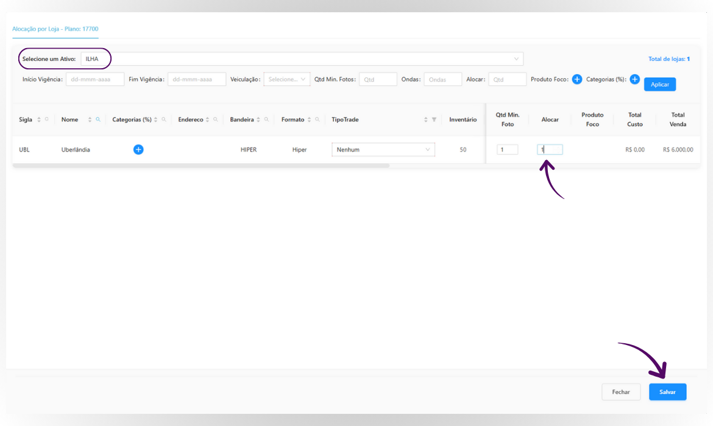<figcaption></figcaption></figure>

↓ Cada ícone possui uma função: é possível editar o ativo clicando no ícone de lápis e excluí-lo clicando no ícone de lixeira.

<figure>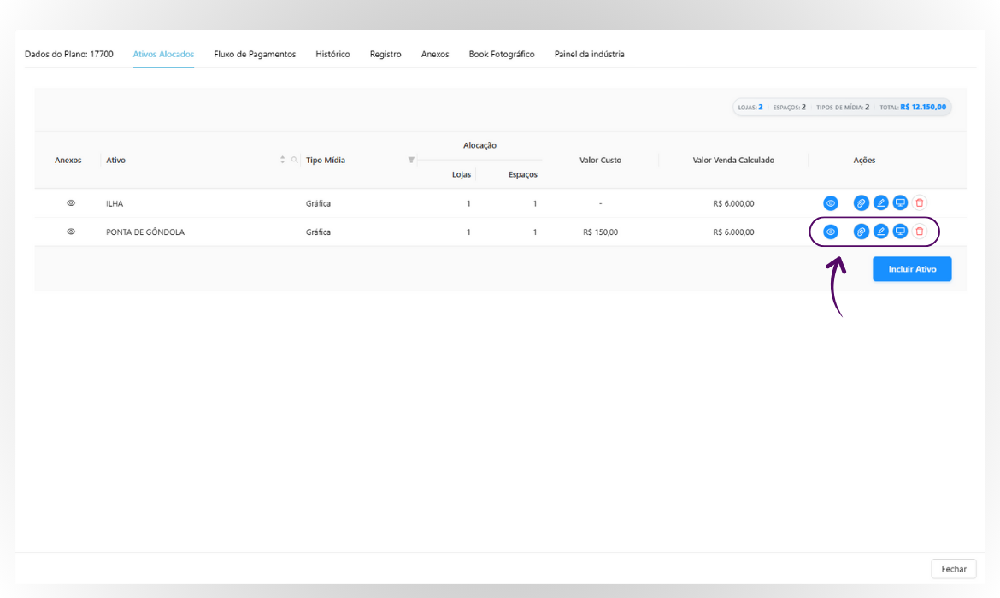<figcaption></figcaption></figure>

***

### 10. A proxima aba se chama "Fluxo de Pagamento"

↓ Após adicionar todos os ativos, definir o valor total e o número de parcelas, você poderá configurar as informações de pagamento nesta aba.

<figure>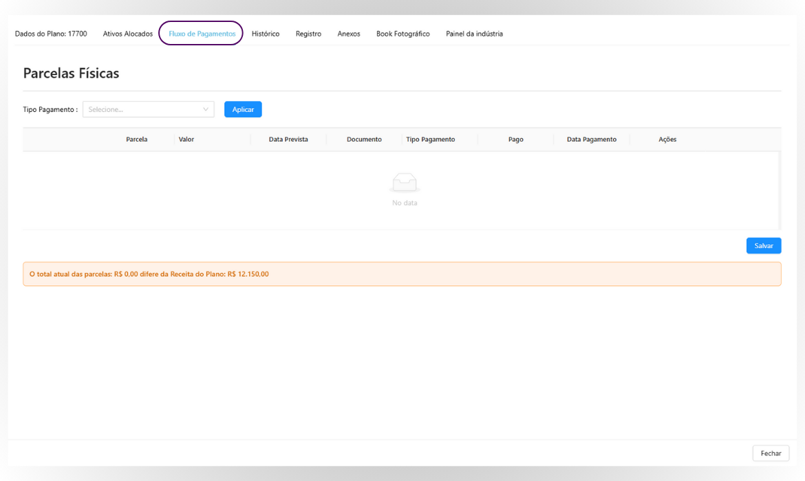<figcaption></figcaption></figure>

↓ Aqui, você pode acompanhar de forma completa todo o fluxo de pagamento desse plano.

<figure>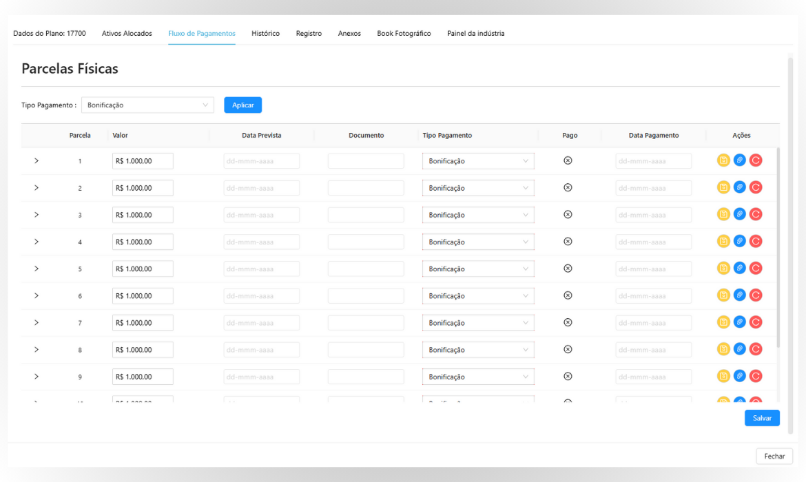<figcaption></figcaption></figure>

***

### 11. Essa aba se chama "Histórico"

↓ Nessa aba, é possível adicionar qualquer tipo de informação. Também serão exibidas todas as alterações feitas na vigência do plano.

<figure>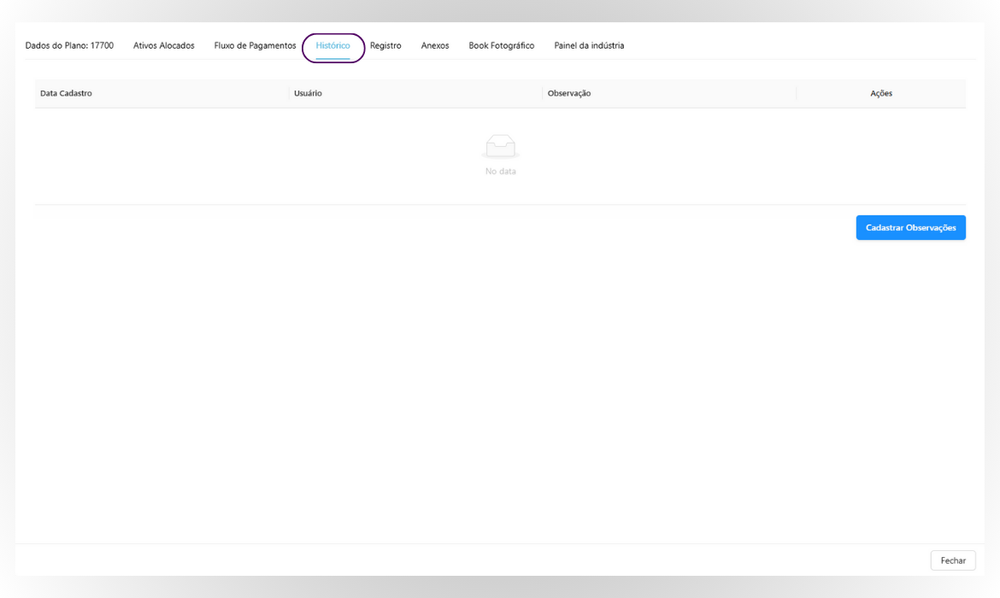<figcaption></figcaption></figure>

***

### 12. A próxima aba é a "Registro"

↓ Aqui é possível registrar ocorrências sobre este plano, como atas de reunião, comentários e outras informações relevantes.

<figure>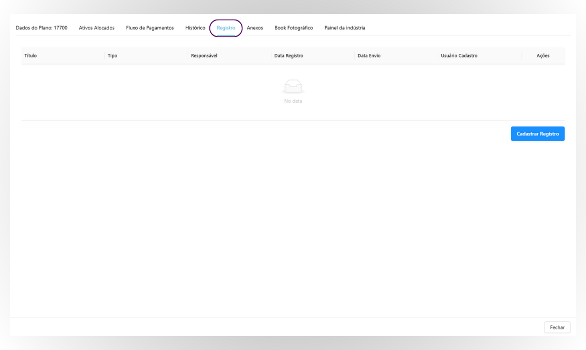<figcaption></figcaption></figure>

***

### 13. Seguindo, temos a aba de "Anexos"

↓ Nessa aba, é possível cadastrar anexos, como contratos ou termos relacionados a esse plano.

<figure>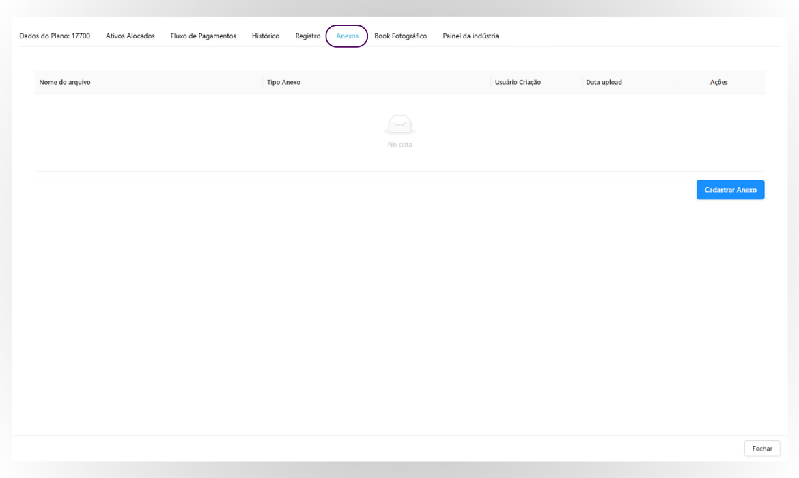<figcaption></figcaption></figure>

***

### 14. A próxima aba se chama "Book Fotográfico"

↓ Aqui, você pode verificar todas as comprovações enviadas dos ativos que foram adicionados ao plano.

<figure>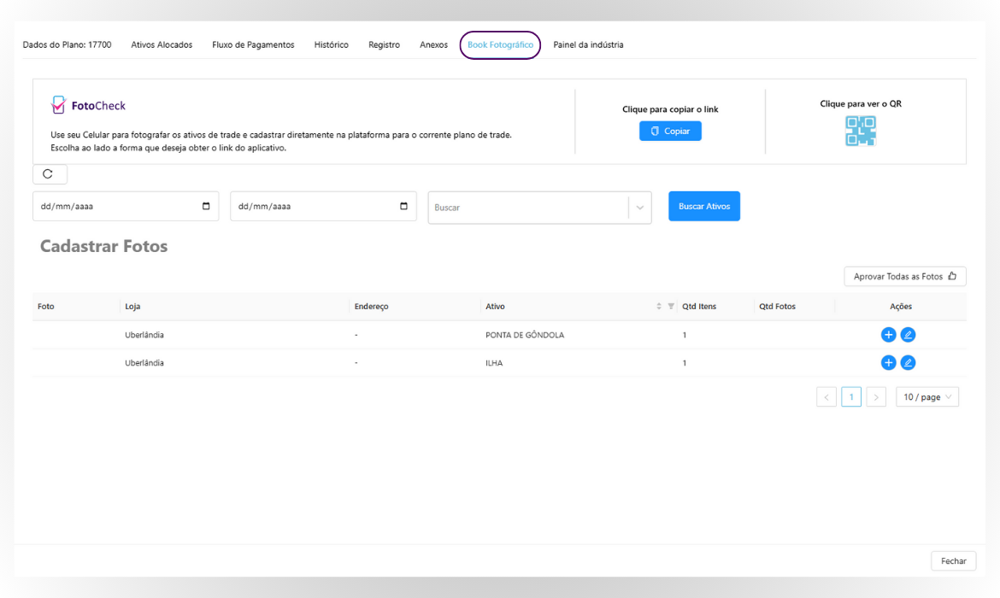<figcaption></figcaption></figure>

***

### 15. Por último, temos a aba "Painel da Indústria"

↓ Aqui é possível adicionar o e-mail do representante da indústria responsável por esse plano. Dessa forma, ele poderá acessar a ferramenta “Painel da Indústria” para visualizar as informações e comprovações relacionadas ao plano.

<figure>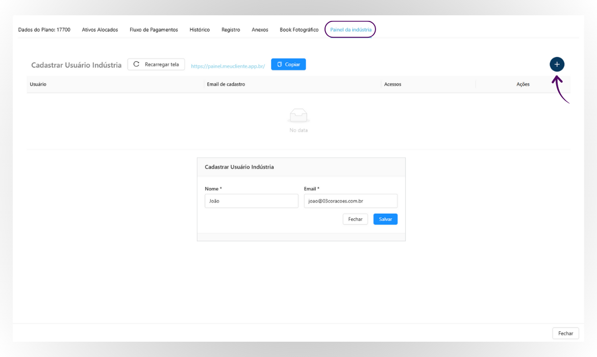<figcaption></figcaption></figure>

***

### 16. Após realizar todas as alterações necessárias no plano, é importante atualizar os dados do plano.

↓ Para alterar o valor total do plano (Receita Plano), você pode usar os campos de “Desconto” ou “Valor Complementar” para diminuir ou aumentar o valor da Receita. Após ajustar os valores, para aprovar o plano, clique em “Situação do Plano” e selecione a opção “Contrato Aprovado”.

<figure>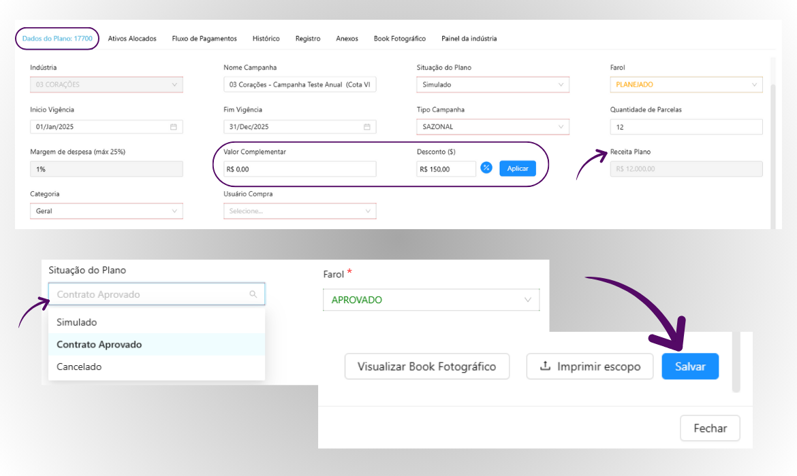<figcaption>
Lembre-se de sempre clicar em “Salvar” após qualquer alteração.
</figcaption></figure>

***

## Agora você já sabe como lançar seus próprios planos na platafora de forma completa e prática! ✅

