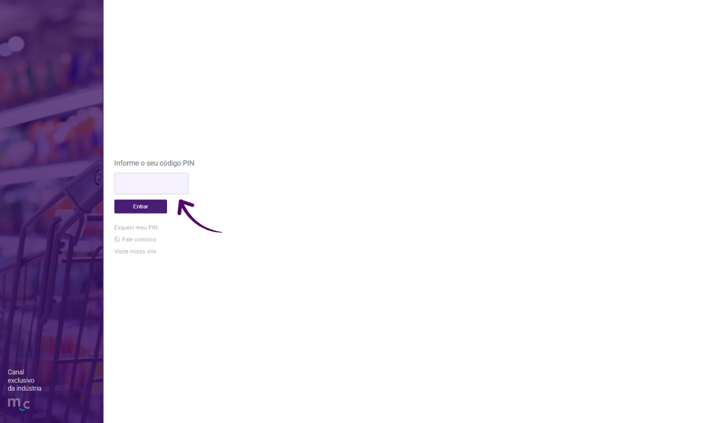
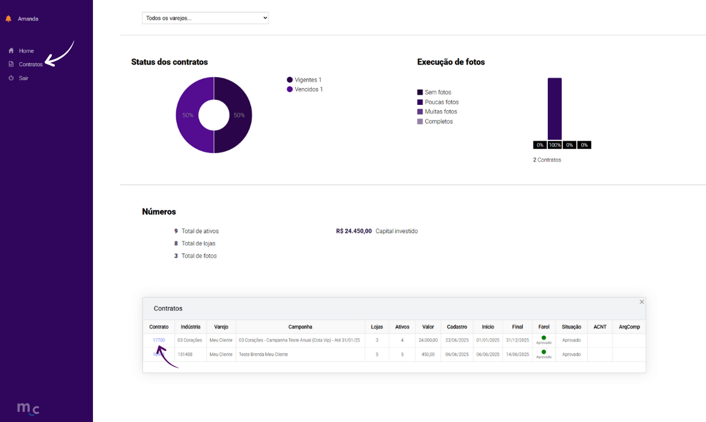
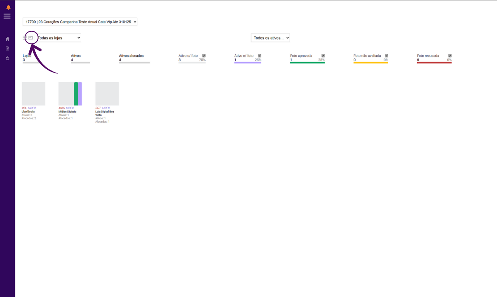
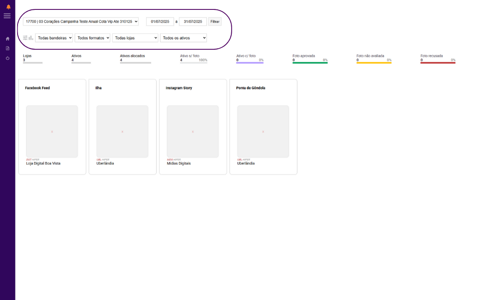
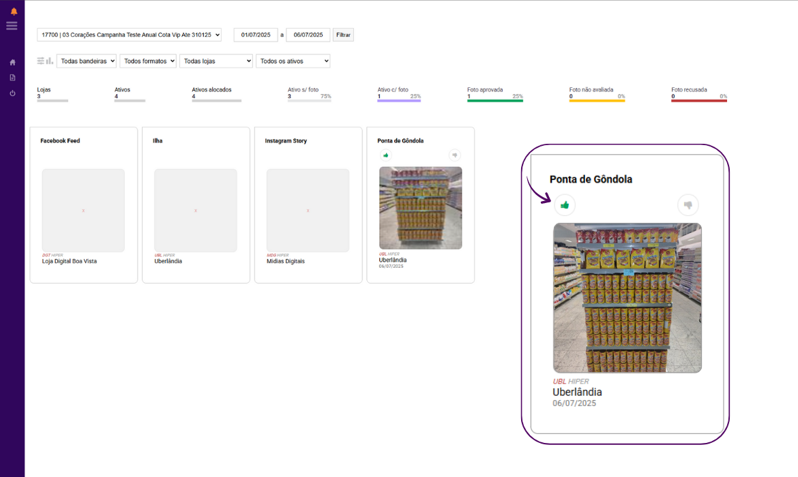

---
---

# Painel da Indústria

## Sejam bem-vindos ao treinamento do Painel da Indústria 🏭

Neste treinamento, vocês irão entender como funciona o Painel da Indústria, ferramenta utilizada pelos fornecedores para visualizar as comprovações das parcerias firmadas em ações de trade marketing com o varejo.



***

### 1. Acesso a plataforma.

👉 [https://painel.meucliente.app.br/](https://painel.meucliente.app.br/)

Cada indústria recebe um PIN exclusivo assim que um novo plano é cadastrado no sistema.\
↓ Com esse código de acesso, a indústria pode entrar na plataforma e acompanhar as comprovações relacionadas ao plano no qual está vinculada.

<figure><figcaption></figcaption></figure>

***

### 2. Ao entrar na a página principal da plataforma, serão exibidos diversos dados sobre os contratos vinculados ao código de acesso utilizado.

No menu lateral, ao clicar em **"Contratos"**, será aberta uma tela com todos os contratos listados, trazendo informações como valor investido, número de ativos, lojas envolvidas, entre outros detalhes.

↓ Para visualizar as comprovações de um contrato específico, basta clicar sobre o **número do contrato** correspondente.

<figure><figcaption></figcaption></figure>

***

### 3. Nesta tela, são apresentados dados detalhados do contrato selecionado.

↓ No canto esquerdo da tela, clique no ícone de imagem para acessar as comprovaçõe enviadas nesse contrato.

<figure><figcaption></figcaption></figure>

***

### 4.  Nesta tela, são exibidas as comprovações dos ativos vinculados ao contrato selecionado.

Na parte superior, há um conjunto de filtros que permitem refinar a visualização das informações. Como:

* Contratos
* Períodos
* bandeiras
* Formatos
* Lojas
* Ativos

↓ Logo abaixo dos filtros, são apresentados nestes quadrados, os ativos relacionados ao contrato e cada um aparece com a sua respectiva loja.

<figure><figcaption></figcaption></figure>

***

### 5. Quando uma comprovação é enviada, ela será exibida nesta tela.

A partir desse ponto, a indústria tem a possibilidade de verificar se a execução está de acordo com o que foi acordado em contrato.&#x20;

↓ Após verificar a imagem, é possível aprovar a execução, confirmando que está conforme o planejado, ou então recusar, caso a foto apresente alguma divergência.

<figure><figcaption></figcaption></figure>

***

## Agora você conhece o funcionamento do _Painel da Indústria_ e sabe como a indústria pode acompanhar e verificar todas as comprovações das parcerias de trade marketing. 🤝

